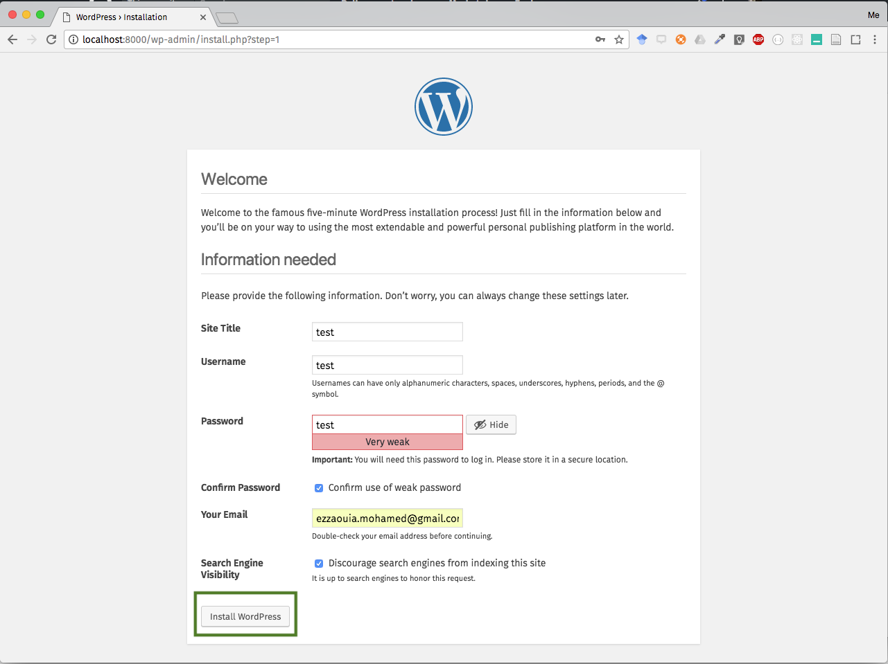

# Installation de docker
Docker permet la mise en œuvre de conteneurs s'exécutant en isolation, via une API de haut-niveau. Construit sur des capacités du noyau Linux (surtout les cgroups et espaces de nommage), un conteneur Docker, à l'opposé de machines virtuelles traditionnelles, ne requiert aucun système d'exploitation séparé et n'en fournit aucun. Il s'appuie plutôt sur les fonctionnalités du noyau et utilise l'isolation de ressources (comme le processeur, la mémoire, les entrées et sorties et les connexions réseau) ainsi que des espaces de noms séparés pour isoler le système d'exploitation tel que vu par l'application. (Source Wikipédia).

Plus d'information sur Docker sur la documentation officielle https://docs.docker.com/

Nous allons utiliser docker pour installer WordPress en local avec ses dépendances, principalement, une base de données MySQL et un serveur PHP dans un conteneur docker, cela nous évite toute la complexité de l'installation.

La communauté de docker a mis en place un script automatisant l'installation de docker, ci-dessous les instructions pour installer la version stable.

Dans votre terminal exécutez les deux instructions suivantes (en ayant sur le dossier courant) :

```shell
curl -fsSL get.docker.com -o get-docker.sh
sh get-docker.sh
```

# Installation de WordPress (Serveur + MySQL)
L'installation des conteneurs sur docker peut être automatisé via un outil de docker nommé `docker-compose`, pour ce faire, il faut créer un fichier `docker-compose.yml` (voir dossier courant) dans lequel on décrit la configuration de l'installation souhaitée.

Pour lancer l'installation des services/applications décrite sur dans un docker compose il faut exécuter dans votre terminal l'instruction suivante (en ayant sur le dossier courant) :

```shell
docker-compose up
```

# Connexion à WordPress via le navigateur
Une fois l'installation est terminée, vous devrez être capable de lancer WordPress sur votre machine locale via votre navigateur en utilisant le lien `http://localhost:8000`

- localhost : car le serveur web qui sert le contenu du WP est installé en local (accessible sur l'adresse de la machine locale localhost ce qui est aussi équivalent 127.0.0.1)
- 8000 : car c'est le port qu'on a choisi pour notre site (WP) et qu'on a mis dans la configuration `docker-compose.yml`

Une fois vous y êtes connecté, choisir la langue, puis username, adresse mail et mot de passe pour la connexion.





# Installation de MySQL WorkBench
MySQL WorkBench est un client qui nous permet d'interagir avec la base de données MySQL (serveur de base données MySQL) pour consulter, ajouter, modifier les données etc.

MySQL WorkBench est un produit d'oracle qu'on peut télécharger depuis `https://dev.mysql.com/downloads/workbench/` en ayant un compte oracle.

Une fois installé, ouvrez-le, et puis cliquez sur le `+` pour ajouter une nouvelle connexion à la base de données MySQL WP.


Une c'est fait, configurez la connexion en utilisant les accès à la base de données que vous avez mis dans `docker-compose` et validez :


Testez la connexion :


Si c'est bon, cliquez sur ok, pour terminer. Puis cliquez sur le nom de la connexion que vous venez d'ajouter.


